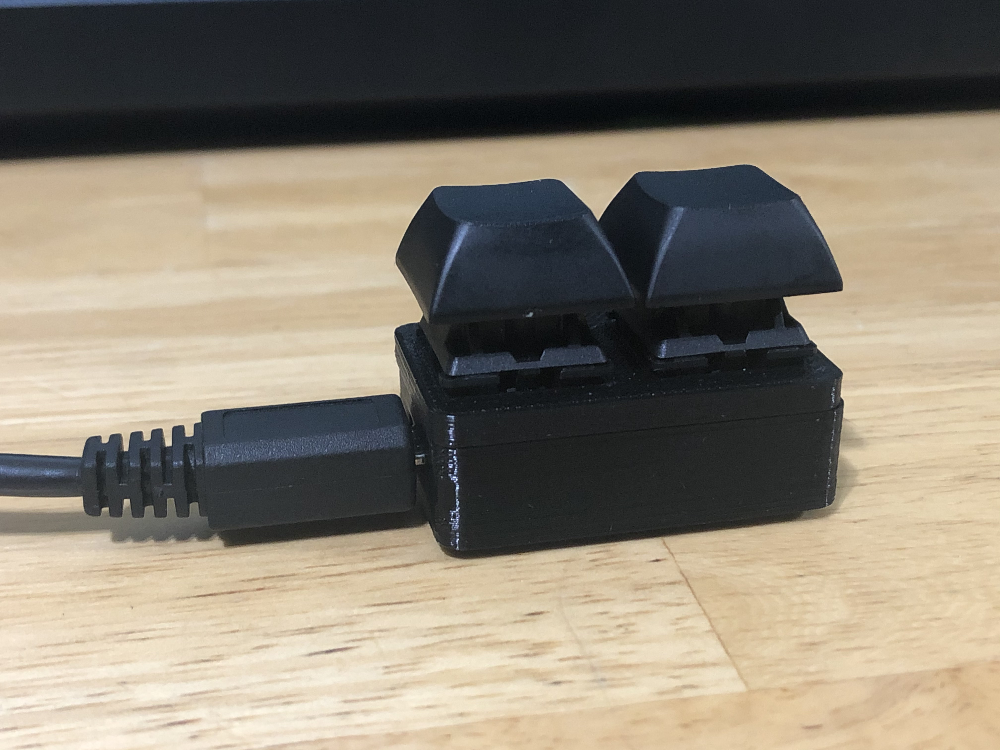

# two_key

Just consolidating all the info I found online for this two-key keyboard build. I designed and 3d printed my own case for the build. Everything else was taken from other sources listed below.

1. Clip the headers so that they're equal length on both sides.
2. Solder the headers to the keyboard PCB.
3. Put the switches into the top plate.
    * The top plate goes *between* the switches and the pcb!
4. Solder the switches to the PCB.
5. Trim the switch pins after soldering to make them as flush as possible with the PCB.
    * This is done to give more clearance to the Pro Micro.
6. Solder the Pro Micro to the headers.
    * The Pro Micro goes *smooth side down* under the PCB! The side with all the components faces up! I learned this the hard way.
7. Put everything into the bottom plate. Should snap fit into place.
8. Using the Arduino IDE, flash the Pro Micro as if it were an Arduino Micro with `two_key.ino`. The library `HID-Project` is also included here but can be downloaded from the Arduino library manager.

Bought from:
https://mehkee.com/collections/keyboards/products/macropad-2-switch-pcb?variant=45125555663
https://www.amazon.com/OSOYOO-ATmega32U4-arduino-Leonardo-ATmega328/dp/B012FOV17O
(And whatever switches you want)

Found the `Gerbers` files here:
https://github.com/asusoverclocked/2key

Found `.ino` files here:
https://github.com/di0ib/Misc/tree/master/pico

Extra info on how this works:
https://www.sparkfun.com/tutorials/337

Another build log (with more pictures than me):
http://www.40percent.club/2016/12/2-keys.html

Misc notes:
This keyboard does indeed support switches with LEDs in them, but mine did not have them. Choose the resistor based on whatever the current rating is for the LED you're using.
